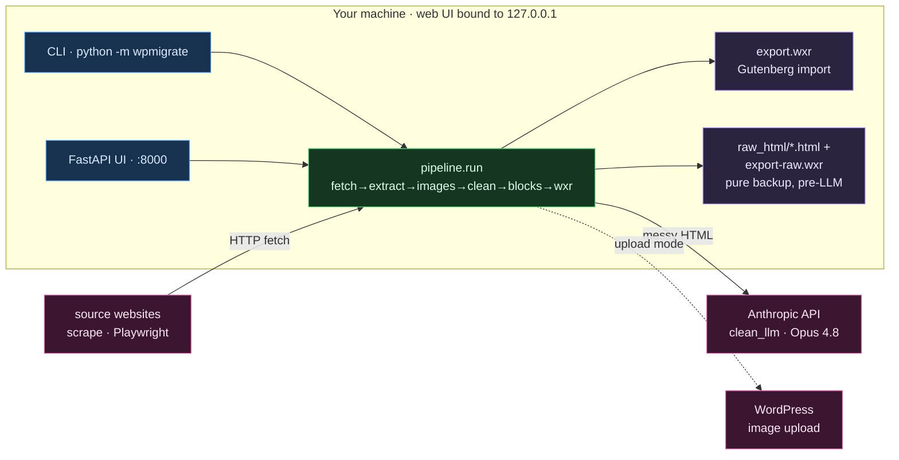

# Architecture: wp-migrator — System Overview

> **TL;DR:** Local Python tool. Scrapes arbitrary sites through a deterministic pipeline and packages them as a WordPress Gutenberg WXR import. Claude handles only the fuzzy cleanup step. A CLI and a localhost-only FastAPI UI share `pipeline.run`.

## The shape

## Scope & surface
- **Trust boundary:** the web UI is **localhost-only** (127.0.0.1), not exposed. Both entry points run the same `pipeline.run` in-process.
- **Secrets from env only:** `ANTHROPIC_API_KEY` (required), `WP_APP_PASSWORD` (upload mode). Never in `config.toml` or code.
- Outbound reach = source sites (scrape) + Anthropic (cleanup) + optional WordPress (image upload). Output is a local `export.wxr`, imported into WP manually.
- Every run also writes a raw-backup side path, independent of `clean_llm`/`blocks` success: each fetched page's untouched HTML goes to `raw_html_dir` (default `raw_html/`), and a second WXR (`<out_stem>-raw.wxr`) is built from the extracted-but-not-blockified content. See [[30-Decisions/0001-componentized-pipeline-and-vault-learning]] — this is phase 1 of a larger componentization; phases 2–3 add an `analyze` stage, a manual-attention report, and a vault-backed pattern/template library ([[60-Patterns/README]], [[70-Templates/README]]).

## Invariants
- Default model is `claude-opus-4-8`; downgrade only via explicit `WPMIGRATE_MODEL` — never auto-downgrade for cost.
- Fix extraction with a per-domain `[selectors]` override first, only then `--render`.

## Where things live
See `CLAUDE.md` (L0 map) for `wpmigrate/` module roles.

## Related
- [[00-Index/Home]]
- [[30-Decisions/0001-componentized-pipeline-and-vault-learning]]
